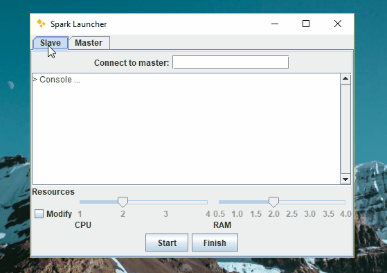
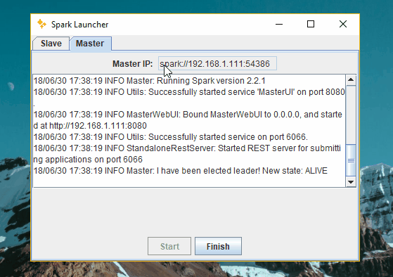

## Sparkler 

:sparkles:Sparkler is a tool to **easily deploy a Master/Worker computing grid at home**. It interfaces the [Apache Spark](https://spark.apache.org/) framework.

* Simple, non-technical app interface
* Automated, fault-tolerant, distributed computing at home
* High-performance computing framework for multiple languages

  
<strong>Table of Contents</strong> (click to expand)

* [Installation](#-installation)
* [Usage](#-usage)
* [Contributing](#-contributing)
* [Resources](#-resources)
* [License](#-license)

### :floppy_disk: Installation

#### Requirements

So far, it has only being tested on
* Windows 8.1, 10, Ubuntu 16.04
* [Java JRE 1.8.0](http://www.oracle.com/technetwork/java/javase/downloads/jre8-downloads-2133155.html)
* (Already compiled) Apache Spark 2.11.8
* winutils (if using Windows OS)

​You can either get an installer from the [latest release](https://github.com/espetro/sparkler/releases) or clone this repository 

`git clone https://github.com/espetro/sparkler.git`

### :arrow_forward: Usage

- How to deploy a master

  

  > Start the app, and press `Start` button on the Master tab. To stop it, press `Finish`. You can see the executors (jobs) and workers connected at [http://localhost:8080/](http://localhost:8080/).
  >
  > The master Spark's URL will be written on the upper field

- How to deploy a worker

  

  >  Start the app on the Slave tab and introduce the Master's URL (`spark://address:port`). Optionally, you can select the amount of CPU/Memory resources the worker will use.
  > You can see the executors (jobs) and worker information at [http://localhost:8081/](http://localhost:8081/).

  

Once at least a master and a worker has been deployed, you can submit Spark jobs with

+ Java using its [Java API](https://spark.apache.org/docs/latest/api/java/index.html); see this [example](https://www.datasciencebytes.com/bytes/2016/04/18/getting-started-with-spark-running-a-simple-spark-job-in-java/).
+ Scala using its [Scala API](https://spark.apache.org/docs/latest/api/scala/index.html#org.apache.spark.package); see this [example](https://www.supergloo.com/fieldnotes/apache-spark-cluster-part-2-deploy-a-scala-program-to-spark-cluster/).
+ Python 3+ with built-in [pyspark](https://spark.apache.org/docs/latest/api/python/index.html); see this [example](https://blog.sicara.com/get-started-pyspark-jupyter-guide-tutorial-ae2fe84f594f).
+ R using built-in [SparkR](https://spark.apache.org/docs/latest/sparkr.html) or [sparklyr](https://spark.rstudio.com/); see this [example](https://spark.apache.org/docs/latest/sparkr.html#starting-up-sparksession).
+ C#, F# and .NET using [Mobius](https://github.com/Microsoft/Mobius); see this [word-count example](https://github.com/Microsoft/Mobius/blob/master/notes/running-mobius-app.md#wordcount-example-batch).
+ Julia using [Spark.jl](https://github.com/dfdx/Spark.jl); see this [example](https://juliacomputing.com/blog/2017/12/12/julia-and-spark.html#sparkjl).

Seemingly, as Spark clusters usually run on remote machines, it's usual to use **Jupyter Notebooks** to submit applications against the cluster. You can see the configuration process [here](https://blog.insightdatascience.com/using-jupyter-on-apache-spark-step-by-step-with-a-terabyte-of-reddit-data-ef4d6c13959a).

### :family: Contributing

Please see [CONTRIBUTING.md](./CONTRIBUTING.md).

### :books: Resources

- [Apache Spark: Hardware Provisioning](https://spark.apache.org/docs/0.9.1/hardware-provisioning.html)
- [Parallelize R code using Apache Spark](https://databricks.com/blog/2017/08/21/on-demand-webinar-and-faq-parallelize-r-code-using-apache-spark.html)
- [Distributed TensorFlow: Scaling Google’s Deep Learning Library on Spark](https://arimo.com/machine-learning/deep-learning/2016/arimo-distributed-tensorflow-on-spark/)
- [GPU Acceleration: Speeding UP Deep Learning on Apache Spark](https://databricks.com/blog/2016/10/27/gpu-acceleration-in-databricks.html)
- [Developing Apache Spark Applications in .NET using Mobius](https://databricks.com/blog/2016/08/03/developing-apache-spark-applications-in-net-using-mobius.html)
- [Livy: A REST Interface for Apache Spark](https://es.hortonworks.com/blog/livy-a-rest-interface-for-apache-spark/)

### :mortar_board: License

[Apache License 2.0](./LICENSE.md)